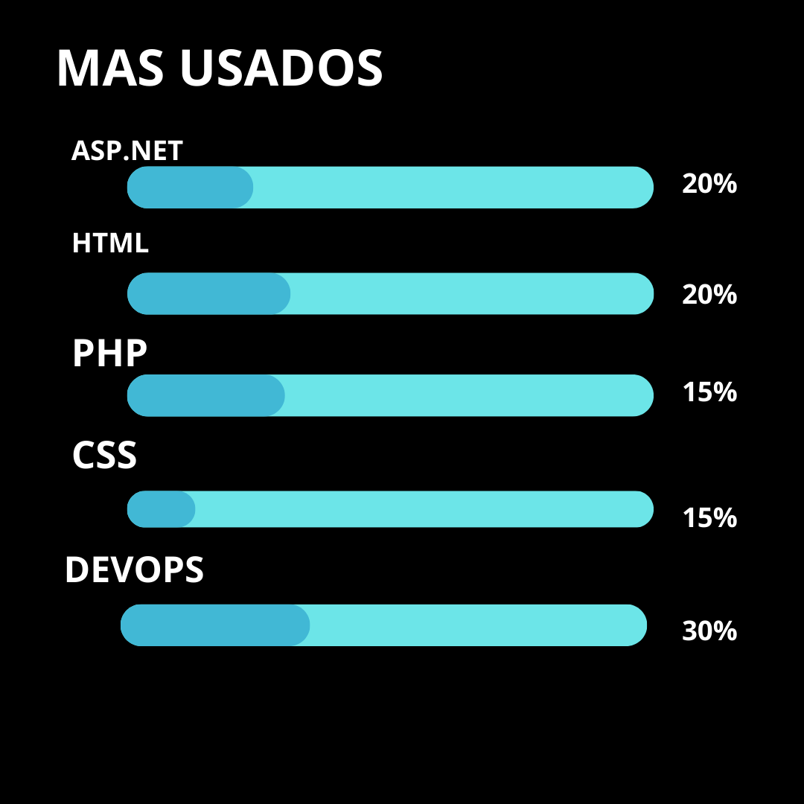

# Hola! Soy Sofia Toro 

  
  

### 🤵 Un poco sobre mi:  
- 🏦 Estudiante de Desarrollo de Sofwtare 
      
- ⌛ Aprovecho mis momentos libres para seguir aprendiendo
- 🌱 Aprendiendo nuevas tecnologias
- 💼En busqueda de Oportunidad de Empleo!
- 📫 Contacto: torokarensofia.21@gmail.com

🛠️ Mis Herramientas favoritas

 
      

<h2 align="center">Lenguajes más usados</h2>

  

